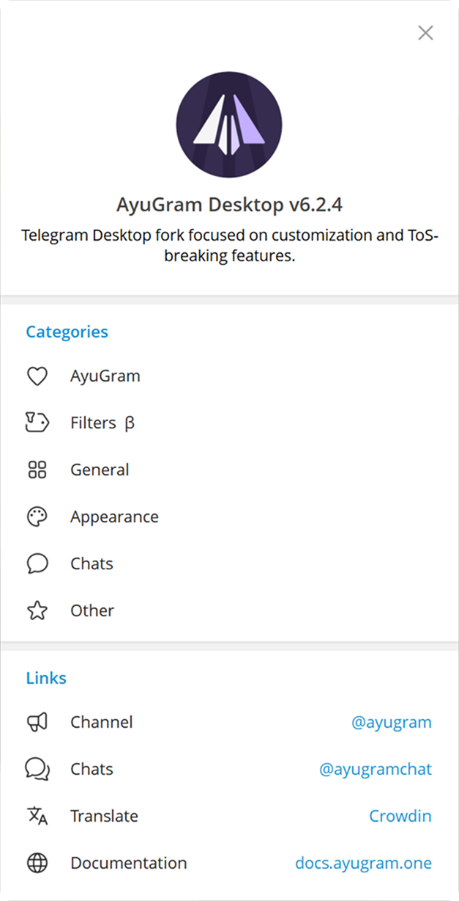
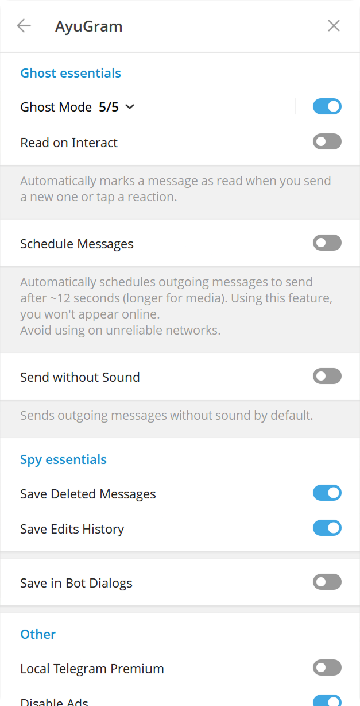
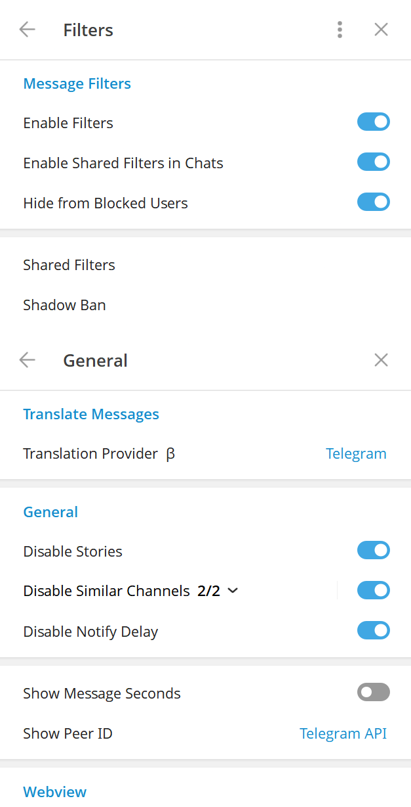
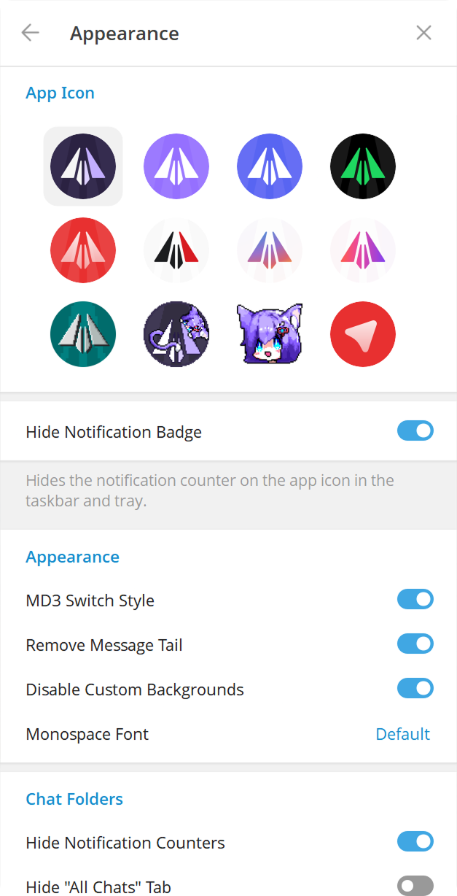
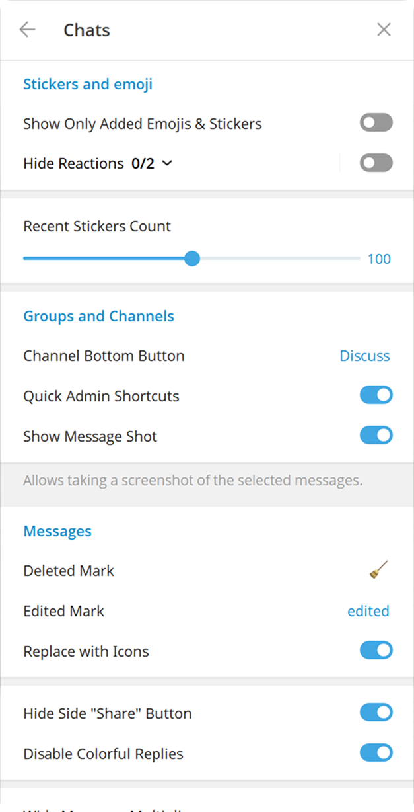

# AyuGram Community Edition

 

> [!WARNING]
> **Made by the community — may contain bugs.**
>
> This is an unofficial, **community-built** version of AyuGram Desktop, rebased on top of **Telegram Desktop 7.0.3**. It is built and maintained by the community, **not** by the official AyuGram team, Radolyn Labs, or Telegram, and is neither affiliated with nor endorsed by them.
>
> Because it tracks a very recent Telegram Desktop release, it **may contain bugs, regressions, or unfinished behaviour**. Use it at your own risk. If you need a stable, officially supported build, use [official AyuGram](https://github.com/AyuGram/AyuGramDesktop).

📦 **[Download the latest release](../../releases/latest)** — installer or portable build for Windows x64.

[ English  |   [Русский](README-RU.md) ]

## Features

- Full ghost mode (flexible)
- Messages history
- Anti-recall
- Font customization
- Streamer mode
- Local Telegram Premium
- Translator
- Media preview & quick reaction on force click (macOS)
- Enhanced appearance

And many more. Check out our [Documentation](https://docs.ayugram.one/desktop/).

<h3>
  <details>
    <summary>Preview</summary>
    <table>
      <tr>
        <td></td>
        <td></td>
        <td></td>
      </tr>
      <tr>
        <td></td>
        <td></td>
      </tr>
    </table>
  </details>
</h3>

## Downloads

### Windows

#### Official

You can download prebuilt Windows binary from [Releases tab](https://github.com/AyuGram/AyuGramDesktop/releases) or from
the [Telegram channel](https://t.me/AyuGramReleases).

#### Winget

```bash
winget install RadolynLabs.AyuGramDesktop
```

#### Scoop

```bash
scoop bucket add extras
scoop install ayugram
```

#### Self-built

Follow [official guide](https://github.com/AyuGram/AyuGramDesktop/blob/dev/docs/building-win-x64.md) if you want to
build by yourself.

### macOS

#### Official

You can download prebuilt macOS package from [Releases tab](https://github.com/AyuGram/AyuGramDesktop/releases).

#### Homebrew

```bash
brew install --cask ayugram
```

### Arch Linux

#### From source (recommended)

Install `ayugram-desktop` from [AUR](https://aur.archlinux.org/packages/ayugram-desktop).

#### Prebuilt binaries

Install `ayugram-desktop-bin` from [AUR](https://aur.archlinux.org/packages/ayugram-desktop-bin).

Note: these binaries aren't officially maintained by us.

### NixOS

#### Flake (recommended)

Install `ayugram-desktop` from [ndfined-crp/ayugram-desktop](https://github.com/ndfined-crp/ayugram-desktop)

#### Nixpkgs

Install `ayugram-desktop` from [nixpkgs](https://search.nixos.org/packages?channel=unstable&show=ayugram-desktop)

### ALT Linux

[Sisyphus](https://packages.altlinux.org/en/sisyphus/srpms/ayugram-desktop/)

### Gentoo Linux

See [this repository](https://codeberg.org/OverLessArtem/ayugram-ebuild-gentoo) for installation manual.

### Void Linux
See [this repository](https://codeberg.org/OverLessArtem/ayugram-template-void) for installation manual.

### EPM

`epm play ayugram`

### Fedora

From [RPM Fusion](https://admin.rpmfusion.org/pkgdb/package/free/ayugram-desktop/) repository.

```bash
dnf install ayugram-desktop
```

### Any other Linux distro

Flatpak: https://github.com/0FL01/AyuGramDesktop-flatpak

Or follow the [official guide](https://github.com/AyuGram/AyuGramDesktop/blob/dev/docs/building-linux.md).

### Remarks for Windows

Make sure you have these components installed with VS Build Tools:

- C++ MFC latest (x86 & x64)
- C++ ATL latest (x86 & x64)
- latest Windows 11 SDK

## Donation

Enjoy using **AyuGram**? Consider sending us a tip!

[Here's available methods.](https://docs.ayugram.one/donate/)

## Credits

### Telegram clients

- [Telegram Desktop](https://github.com/telegramdesktop/tdesktop)
- [Kotatogram](https://github.com/kotatogram/kotatogram-desktop)
- [64Gram](https://github.com/TDesktop-x64/tdesktop)
- [Forkgram](https://github.com/forkgram/tdesktop)

### Libraries used

- [JSON for Modern C++](https://github.com/nlohmann/json)
- [SQLite](https://github.com/sqlite/sqlite)
- [sqlite_orm](https://github.com/fnc12/sqlite_orm)
- [androidx sources](https://github.com/androidx/androidx)

### Icons

- [Solar Icon Set](https://www.figma.com/community/file/1166831539721848736)

### Bots

- [TelegramDB](https://t.me/tgdatabase) for username lookup by ID (until closing free inline mode at 2 April 2026)
